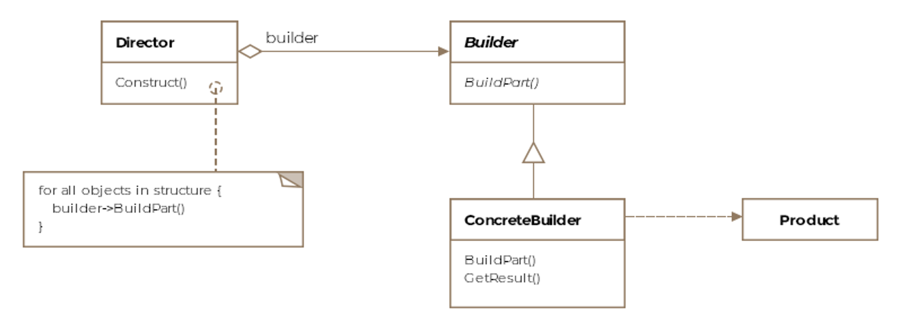

### Builder pattern



- A builder pattern is used to build objects. Sometimes, the objects we create can be complex, 
made up of several sub-objects or require an elaborate construction process.

- Formally, builder pattern encapsulates or hides the process of building a complex object and separates the 
representation of the object and its construction. The separation allows us to construct different 
representations using the same construction process.

#### HTTP request format
```
### Necessary ###
<http method (ex: GET)> <path (ex: /)> <http version (ex: HTTP/1.1)>
Host: <domain/ip (ex: example.com)>

### Headers ###
User-Agent: Mozilla/5.0 (Ubuntu; Linux x86_64;) Firefox/78.0
Accept: text/html, application/xhtml+xml,application/xml
Accept-Language: en-US, en;q=0.5
Accept-Encoding: gzip, deflate
Connection: close

### Body ###
```

#### The process for creating an HTTP request with Builder pattern

1.  Create the product (HttpRequest)
2.  Create the abstract interface class (IHttpRequestBuilder)
    - The builder contains a method for each component that can be part of the final product (HttpRequest). 
    - These methods are selectively overridden by concrete builders depending on if the builders will be including that part in the final product variant that they are responsible for building.
3.  Implement a concrete builder that extends the abstract interface class
    - Implement all methods and attributes
4.  (optional) create a Director class that builds the product's (HttpRequest) components/features without returning it
    ```java
    public class Director {
    
        Builder builder;
    
        public Director(Builder builder) {
            this.builder = builder;
        }
    
        public void construct(boolean option) {
            builder.buildFeature1();
            builder.buildFeature2();
            builder.buildFeature3();
    
            if (option)
                builder.buildFeature4();
        }
    }
    ```
5.  Last step, Either use the Director class or build components/features manually, then call `.build` to get the product