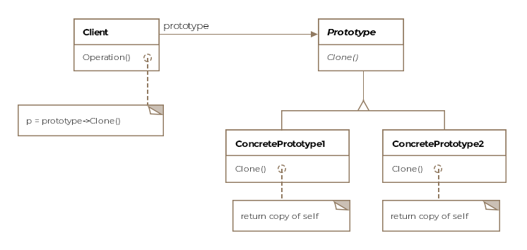

## Prototype pattern

Prototype pattern involves creating new objects by copying existing objects. 
The object whose copies are made is called the **Prototype**.

You can think of the prototype object as the seed object from which other objects get created

#### Process

1. Create the **Prototype** abstract/interface class (AbstractHttpRequest). (must have a **clone** method)
2. Create the **concrete prototypes** that extends/implements the abstract/interface class.