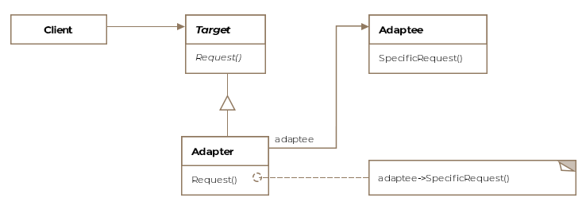

## Adapter

The adapter design pattern allows incompatible classes to interact with each other by converting the interface
one class into an interface expected by the clients.

### Process (Employees XML to JSON adapter)

1. Create/set up the **adaptee** library/class (EmployeeManager)
2. Create the **target** (IEmployee)
3. Create the **adapter** (EmployeeAdapter)
    - Should implement **target** (IEmployee)
    - Should **extend** the lib/class (EmployeeManager), call the super class if needed. 
    - or **create an instance** and pass it to the adapter as an argument.
4. Use the adapter in your main program
